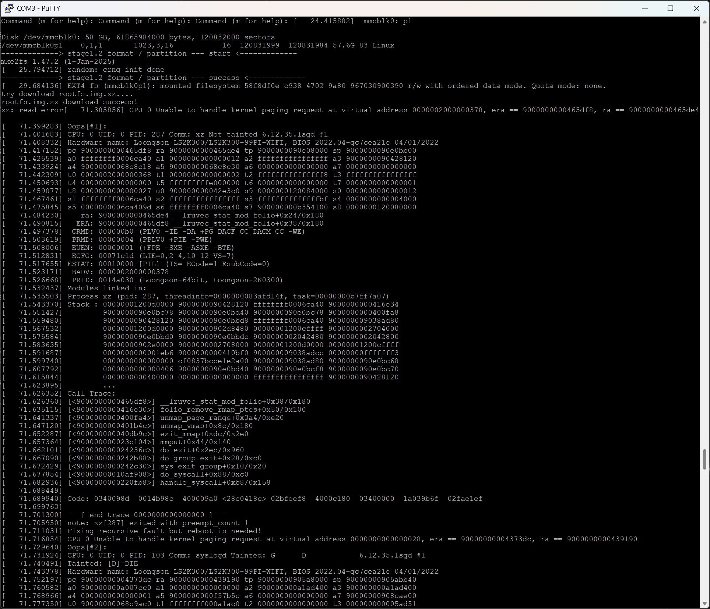
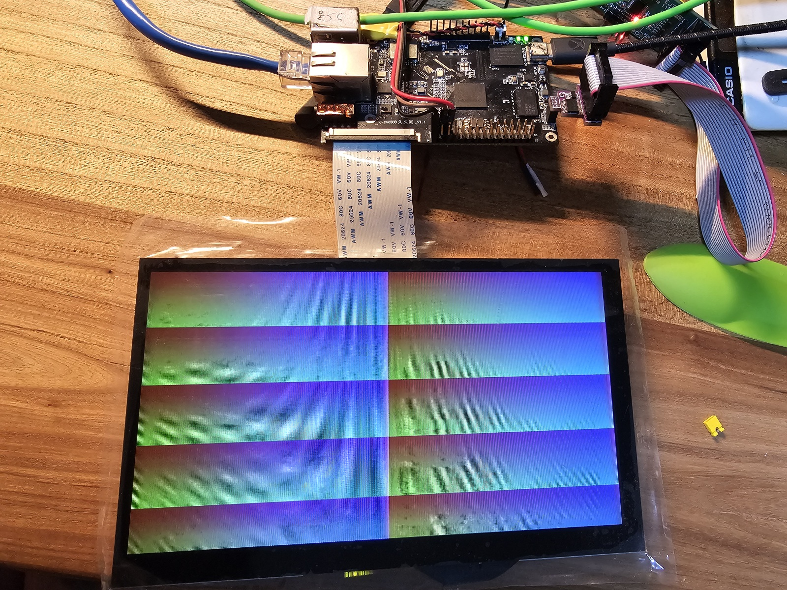
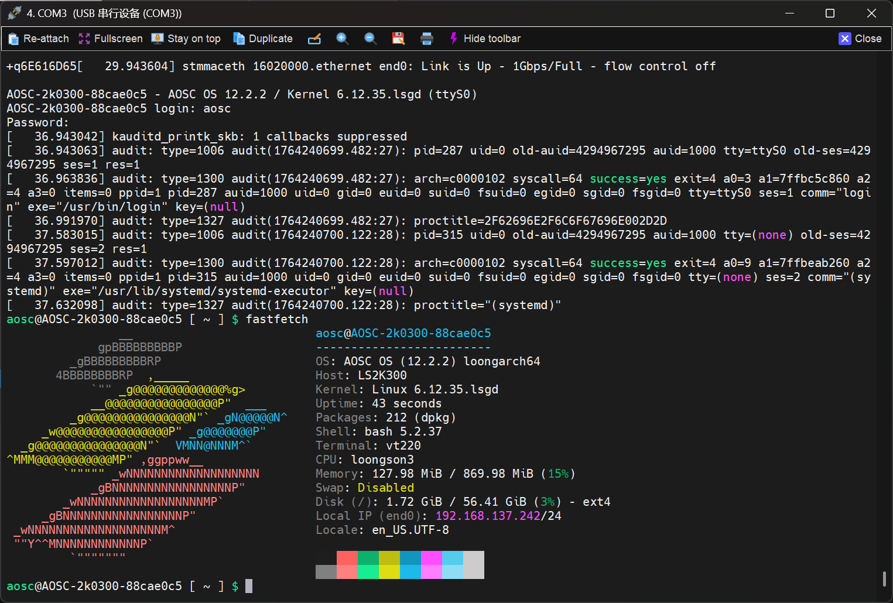

# 龙芯 2K0300 使用 2 GiB DRAM 时的奇怪现象记录

## 起因

昨天（2025年11月28日）我给 2K0300 久久派 WiFi 版换上了一片 2GiB 容量的 DDR4 内存芯片，型号为三星的 K4AAG165WB-MCTD。修改 U-Boot 设备树后，内存训练一切顺利，甚至可以启动 AOSC OS，`free -h` 显示有 1.7GB 可用。今天（2025年11月29日）我就尝试给这块板子换了一颗 64GiB 的 eMMC芯片，启动后也能正常被 U-Boot 识别。于是我也开始测试 AOSC OS 为 2K0300 制作的新镜像。走加载 RAMDisk、下载 rootfs 安装操作系统的流程；然而：在解压 rootfs.tar.xz 时，RAMDisk 里的 Linux 内核开始报错：



报错很长，在写 writeup 的时候 PuTTY 早已经卷过了那部分，中间有很多嵌套的报错略去，最后内核崩溃：


看到报错信息，类似“Unable to handle kernel paging request at virtual address ...”，BAD_PAGE taint 标志，判断极大概率和我换的这颗内存有关。那么，怎么测试这颗内存到底有什么问题呢？

## 2K0300 谜一样的内存映射体系

翻看[数据手册(v1.01)](https://loongson.cn/uploads/images/2025060909245168407.%E9%BE%99%E8%8A%AF2K0300%E5%A4%84%E7%90%86%E5%99%A8%E6%95%B0%E6%8D%AE%E6%89%8B%E5%86%8C_V1.01.pdf)和[用户手册(v1.01)](https://loongson.cn/uploads/images/2025060909243029508.%E9%BE%99%E8%8A%AF2K0300%E5%A4%84%E7%90%86%E5%99%A8%E7%94%A8%E6%88%B7%E6%89%8B%E5%86%8C_V1.01.pdf)可以发现以下几个问题：

1. 只说明了 2K0300 的 DDR4 控制器支持多少多少根行列地址线，没有说支持多大容量的内存。

2. 明明像久久派这种板卡出货时有带 512MiB 的 DRAM，用户手册上的“3.2 地址空间分配”一节却只写了 0x0000_0000 到 0x0000_FFFF 这一段 256MiB 的空间为所谓“L-DDR”区域。我猜测这就是 DDR 内存的低 256MiB的那部分。但是更高位地址空间的部分一概是保留。

3. “3.2 地址空间分配”一节的最后介绍 DMA 视角下的地址空间样貌，DDR 占据了 2GiB 的空间。但仍然没有证据佐证这颗 SoC 是否支持 2GiB DRAM。

手册上没有，就从代码里找。打开[广东龙芯提供的 U-Boot 源码](https://gitee.com/open-loongarch/u-boot/)。

2K0300 蜂鸟板默认使用的是一颗三星 K4A4G165（512MiB）内存颗粒，使用的设备树文件是 [arch/loongarch/dts/ls2k300_ddr_samsung_512m.dtsi](https://gitee.com/open-loongarch/u-boot/blob/master/arch/loongarch/dts/ls2k300_ddr_samsung_512m.dtsi)。打开设备树源码可以见到：

```dts
	memory {
		name = "memory";
		device_type = "memory";
		reg = <0x90000000 0x00000000 0 0x10000000
		       0x90000000 0x90000000 0 0x10000000>;
		u-boot,dm-pre-reloc;
	};
```

`0x9xxx_xxxx_xxxx_xxxx` 地址段熟悉龙芯板卡的人应该都知道，这是龙芯设备惯例配置的 Coherent Cached DMW 窗口（另有 Strong-Ordered Uncached DMW 窗口则是`0x8xxx_xxxx_xxxx_xxxx`），在 DMW 内可以直接访问物理地址。这里的 `reg` 实际上是一个 2 列的表格，每两个 32 位的数拼成一个 64 位整数：第一列是 64 位的基地址、第二列是 64 位的内存块大小，每一行都代表“系统上哪些物理地址是可用的 RAM”。所以上面的 `reg` 实际表示：

|RAM 块基地址|RAM 块大小|
|-|-|
|0x9000_0000_0000_0000|0x1000_0000|
|0x9000_0000_9000_0000|0x1000_0000|

注意到，`0x9000_0000` 这个在手册中从未出现过的地址上其实坐落着 DDR 的映射区域。将 L-DDR 区域的 256MiB 和这里的神秘 256MiB 区域合起来就有了 512MiB 的内存空间。

其实，可以查看其他内存配置文件：

- `ls2k300_ddr_isocom_1g.dtsi`

    ```
    		reg = <0x90000000 0x00000000 0 0x10000000
    		       0x90000000 0x90000000 0 0x30000000>;
    ```

- `ls2k300_ddr_isocom_2g.dtsi`

    ```
    		reg = <0x90000000 0x00000000 0 0x10000000
    		       0x90000000 0x90000000 0 0x70000000>;
    ```

    （顺带一提，Isocom 2G 的内存配置文件也是让我认为 2K0300 能支持 2GiB DRAM 的一个因素）

这两个配置提供给系统的物理内存信息的区别就是，简单地将位于 `0x9000_0000_9000_0000` 的映射区域增大。1GiB 的配置文件就是把它改成 768MiB，2GiB 的配置文件就是改成 1792MiB。这块神秘的内存区域映射了什么？

## 祖宗之法

2K0300 的手册不好看，我们还可以看 2K0500 和 2K1000LA 的手册嘛，毕竟都是 2K 系列的。而这两款 SoC 的手册比较好地解释了这一大片在 2K0300 的手册里称作“保留”的地址空间究竟有些什么东西。

[2K1000LA 用户手册](https://www.loongson.cn/uploads/images/2022090113542571398.%E9%BE%99%E8%8A%AF2K1000LA%E5%A4%84%E7%90%86%E5%99%A8%E7%94%A8%E6%88%B7%E6%89%8B%E5%86%8C.pdf) 第 6 章介绍的地址空间分配就讲到：在 2K1000LA 上，除了和 2K0300 如出一辙的低 256MiB 映射到 DRAM、紧跟的 256MiB 映射到各种 MMIO 和外设的地址空间以外，它的物理地址 `0x8000_0000`（偏移量 2GiB）处还有一个大小为 2GiB 的空间映射到 DRAM、紧跟在后面 `0x1_0000_0000` （偏移量 4GiB）处有一个大小为 4GiB 的空间映射到 DRAM、紧跟着的`0x2_0000_0000`（偏移量 8GiB）处有一个大小为 8GiB 的空间映射到 DRAM。

[2K0500 用户手册](https://www.loongson.cn/uploads/images/2023042109171499358.%E9%BE%99%E8%8A%AF2K0500%E5%A4%84%E7%90%86%E5%99%A8%E7%94%A8%E6%88%B7%E6%89%8B%E5%86%8C_v1.0.pdf) 5.3 节介绍的地址空间分配显示：除了和 2K0300、2K1000LA 几乎一样安排的低 256MiB 区域外，同样在 `0x8000_0000` 处有一个大小为 2GiB 的空间映射到 DRAM，但后面那些大小呈指数级增加的内存块都消失了。

话说回来到 2K0300 上，我们有理由相信 2K0300 的 DRAM 映射方式（不包括其他的外设、寄存器空间和总线地址空间）和 2K0500 是相同的：物理地址空间最低 256MiB 都是 DRAM 的最低 256MiB，而在 `0x8000_0000` 处又放了一个 2GiB 大小的空间映射到 DRAM 上。这大概是传承的祖宗之法吧。

## 内存测试

由于 2K0300 没有 UEFI 跑不了 MemTest86+，那就得另辟蹊径测试内存了。最简单的当然还是在 U-Boot 里用 `mtest` 命令了。由于 U-Boot 自己就住在 DDR 里执行，跑的时候要注意一下地址范围，用 `bdinfo` 看一下哪里有占用：

```
=> bdinfo
boot_params = 0x900000000cc12390
DRAM bank   = 0x0000000000000000
-> start    = 0x9000000000000000
-> size     = 0x0000000010000000
DRAM bank   = 0x0000000000000001
-> start    = 0x9000000090000000
-> size     = 0x0000000070000000
flashstart  = 0x0000000000000000
flashsize   = 0x0000000000000000
flashoffset = 0x0000000000000000
baudrate    = 115200 bps
relocaddr   = 0x900000000dc00000
reloc off   = 0x0000000000000000
Build       = 64-bit
current eth = ethernet@0x16020000
ethaddr     = ba:15:7c:e1:9e:e5
IP addr     = 192.168.137.2
fdt_blob    = 0x900000000ecc7600
new_fdt     = 0x900000000cbf9bf0
fdt_size    = 0x00000000000021e0
Video       = dvo@0 active
FB base     = 0x900000000dc00000
FB size     = 1024x600x32
lmb_dump_all:
 memory.cnt  = 0x2
 memory[0]      [0x9000000000000000-0x900000000fffffff], 0x10000000 bytes flags: 0
 memory[1]      [0x9000000090000000-0x90000000ffffffff], 0x70000000 bytes flags: 0
 reserved.cnt  = 0x2
 reserved[0]    [0x900000000cbf67a0-0x900000000ebfffff], 0x02009860 bytes flags: 0
 reserved[1]    [0x900000000f000000-0x900000000fffffff], 0x01000000 bytes flags: 4
devicetree  = board
```

可以看到 U-Boot 把自己（reserved）、设备树（new_fdt、fdt_blob）和帧缓冲区都放在了 `0x0cbf_9bf0` 以上、`0xffff_ffff` 以下的一片区域里。那么我们测试

```
=> mtest 0 0x0cbf0000
Testing 00000000 ... 0cbf0000:
Pattern 00000000  Writing...  Reading...ading...Iteration:     17
Tested 17 iteration(s) with 0 errors.
```

结果一切正常，低 256MiB 没有问题。

既然看起来 U-Boot 没在高 1792MiB 里分配什么东西，那么我们干脆全测了：

```
mtest 0x9000000090000000 0x90000000ffffffff
```

执行后诡异的事情发生了：U-Boot 卡死了，而我连接的屏幕也显示出了有规律的花纹图案。看起来对高内存的写入居然覆盖了帧缓冲区和 U-Boot 本身？

```
=> mtest 0x9000000090000000 0x90000000ffffffff
Testing 9000000090000000 ... 90000000ffffffff:
Pattern 00000000  Writing...
```



于是我尝试：对高 1792MiB的地址空间，分成 256MiB大小的块测试：

```
=> mtest 0x90000000 0xa0000000
Testing 90000000 ... a0000000:
Pattern FFFFFFFFFFFFFFFF  Writing...  Reading...n:     10:      9
Tested 10 iteration(s) with 0 errors.
=> mtest 0xa0000000 0xb0000000
Testing a0000000 ... b0000000:
Pattern 00000000  Writing...  Reading...ading...Iteration:     11
Tested 11 iteration(s) with 0 errors.
=> mtest 0xb0000000 0xc0000000
Testing b0000000 ... c0000000:
Pattern 00000000  Writing...  Reading...ading...Iteration:     11
Tested 11 iteration(s) with 0 errors.
=> mtest 0xc0000000 0xd0000000
Testing c0000000 ... d0000000:
Pattern 00000000  Writing...
```

测到 `0xc000_0000` 到 `0xd000_0000` 之间时，系统以相同的方式崩溃了。这里正好是偏移量 1GiB ~ 1GiB+256MiB 之间的内存区域。恰好，帧缓冲区等重要数据位于偏移量 0B ~ 256MiB 之间的内存区域。难道 2K0300 在 `0x9000_0000` 处映射的是低 1GiB 的内存吗？

## 挖掘映射配置

你可能知道，龙芯的 CPU 核发出的访存操作到达各 Slave 前要经过一个交叉开关，这个组件有着名称形如 BASE、MASK、MMAP 的一系列寄存器，这三个寄存器所形成的一个个三元组就代表着一个映射窗口。

虽然 2K0300 的手册没有提到这些寄存器的存在，我们依然可以找“祖宗之法”：参考 [3A6000 用户手册](https://loongson.cn/uploads/images/2024072510054986439.Loongson3A6000%20user%20book_V1.2.pdf)的 3.2 节“地址路由分布与配置”，它描述道：“地址窗口转换寄存器如下表所示。基地址为 `0x1FE0_0000`，或者通过 IOCSR 指令访问”，并列出一系列从 0x2000 偏移量开始的寄存器地址。这实际上给我们的信息是：在 3A6000 上，地址窗口转换寄存器位于 IOCSR 地址空间的 0x2000 偏移量处。看 2K0300 用户手册 3.2 节“地址空间分配”可知，`0x1600_0000` 到 `0x1600_ffff` 这片内存区域是所谓的“CHIP-CONFIG” 区域，大胆猜测这就是指 IOCSR 地址空间。那么我们在 2K0300 上碰碰运气试试，掏出 EJTAG：

```
cpu0 -d8 0x8000000016002000 48
#d8 0x8000000016002000 48
8000000016002000: 0000000000000000 0000000080000000 ................
8000000016002010: 0000000016020000 0000000016030000 ................
8000000016002020: 0000000016040000 0000000016080000 ................
8000000016002030: 0000000016090000 0000000010000000 ................
8000000016002040: 0000000012000000 0000000014000000 ................
8000000016002050: 0000000016000000 000000001c000000 ................
8000000016002060: 0000000020000000 0000000016100000 ... ............
8000000016002070: 0000000000000000 0000010000000000 ................
8000000016002080: fffffffff0000000 ffffffff80000000 ................
8000000016002090: ffffffffffff0000 ffffffffffff0000 ................
80000000160020a0: fffffffffffc0000 ffffffffffff0000 ................
80000000160020b0: ffffffffffff0000 fffffffffe000000 ................
80000000160020c0: fffffffffe000000 fffffffffe000000 ................
80000000160020d0: fffffffffffe0000 fffffffffff00000 ................
80000000160020e0: fffffffff0000000 fffffffffff00000 ................
80000000160020f0: 0000000000000000 ffffffffffff0000 ................
8000000016002100: 00000000000000f0 00000000800000f0 ................
8000000016002110: 0000000016020082 0000000016030083 ................
8000000016002120: 0000000016040081 0000000016080081 ................
8000000016002130: 0000000016090084 00000000100000b5 ................
8000000016002140: 0000000012000085 0000000014000085 ................
8000000016002150: 0000000016000085 000000001c0000b5 ................
8000000016002160: 00000000200000b5 0000000016100086 ... ............
8000000016002170: 0000000000000000 0000000016000085 ................
```

可见这里的确是 2K0300 的窗口转换寄存器区域。2K0300 的交叉开关实现了 16 个 Slave。dump 的结果中，前 16 个 BASE 寄存器很多都能和用户手册中提及的一些外设占有的地址对上，中间 16 个有很多 FF 的毫无疑问是 MASK 寄存器，剩下的 16 个就理所当然是 MMAP 寄存器了。

一眼就能看出，有两个转换窗口 BASE 基地址分别是 `0x0000_0000_0000_0000` 和 `0x0000_0000_8000_0000`，而 MASK 掩码分别是 `0xffff_ffff_f000_0000` 和 `0xffff_fff8_0000_0000`。根据 3A6000 用户手册对于窗口命中方式的描述。第一个窗口要求访问地址在 `0x0000_0000` 到 `0x0fff_ffff` 之间，第二个窗口要求访问地址在 `0x8000_0000` 到 `0xffff_ffff` 之间（MASK 只掩到了地址第 4 个字节的最高位，要求它必须为 1），并且这两个窗口的 Slave ID 都为 0，可以推断，2K0300 的 DRAM 内存映射方式和 2K0500 手册描述应当是一致的：一个低 256MiB，一个高位 2GiB，并且 Slave 0 应该就是 DRAM 控制器。

## 实验的实锤

看起来 2K0300 没有在地址映射这里砍掉 2GiB 支持，这和上面实验的结果矛盾。由于此时我判断 Linux 很有可能是在调用高 1GiB 内存时因为绕回了低 1GiB 部分导致系统崩溃，我继续在 U-Boot 做了下面几个实验：

1. 直接用 mtest 干帧缓冲区，确认这玩意最好真的能正常工作：

    ```
    mtest 0x800000000dc00000 0x800000000dc10000
    ```

    结果是屏幕顶上一行开始蓝白闪烁，证明正常。

2. 用 EJTAG 写帧缓冲区

    本来帧缓冲区占用的是 `0x0dc0_0000` 处的一片内存区域，但当我写入到 `0xcdc0_0000` 时，依然能看到屏幕左上角出现一个小光点：

    ```
    m8 0x80000000cdc00000 0x55aa55aa55aa55aa
    ```

3. 往低 256MiB 里写东西，再从 0xc000_0000 读

    结果是：从 0xc000_0000 地址读出来的不仅有在低 256MiB 里写过的东西，甚至这些结果自己就是一直循环重复出现的：

    ```
    cpu0 -d8 0x8000000000000000
    #d8 0x8000000000000000
    8000000000000000: 8000000000000000 8000000000000008 ................
    8000000000000010: 8000000000000010 8000000000000018 ................
    8000000000000020: 8000000000000020 8000000000000028  .......(.......
    8000000000000030: 8000000000000030 8000000000000038 0.......8.......
    8000000000000040: 8000000000000040 8000000000000048 @.......H.......
    8000000000000050: 8000000000000050 8000000000000058 P.......X.......
    8000000000000060: 8000000000000060 8000000000000068 `.......h.......
    8000000000000070: 8000000000000070 8000000000000078 p.......x.......
    8000000000000080: 8000000000000080 8000000000000088 ................
    8000000000000090: 8000000000000090 8000000000000098 ................
    80000000000000a0: 80000000000000a0 80000000000000a8 ................
    80000000000000b0: 80000000000000b0 80000000000000b8 ................
    80000000000000c0: 80000000000000c0 80000000000000c8 ................
    80000000000000d0: 80000000000000d0 80000000000000d8 ................
    80000000000000e0: 80000000000000e0 80000000000000e8 ................
    80000000000000f0: 80000000000000f0 80000000000000f8 ................
    8000000000000100: 8000000000000100 8000000000000108 ................
    8000000000000110: 8000000000000110 8000000000000118 ................
    8000000000000120: 8000000000000120 8000000000000128  .......(.......
    8000000000000130: 8000000000000130 8000000000000138 0.......8.......
    8000000000000140: 8000000000000140 8000000000000148 @.......H.......
    8000000000000150: 8000000000000150 8000000000000158 P.......X.......
    8000000000000160: 8000000000000160 8000000000000168 `.......h.......
    8000000000000170: 8000000000000170 8000000000000178 p.......x.......
    cpu0 -m8 0x8000000000000010 0x1145141919810
    #m8 0x8000000000000010 0x1145141919810
    cpu0 -d8 0x8000000000000000
    #d8 0x8000000000000000
    8000000000000000: 8000000000000000 8000000000000008 ................
    8000000000000010: 0001145141919810 8000000000000018 ...AQ...........
    8000000000000020: 8000000000000020 8000000000000028  .......(.......
    8000000000000030: 8000000000000030 8000000000000038 0.......8.......
    8000000000000040: 8000000000000040 8000000000000048 @.......H.......
    8000000000000050: 8000000000000050 8000000000000058 P.......X.......
    8000000000000060: 8000000000000060 8000000000000068 `.......h.......
    8000000000000070: 8000000000000070 8000000000000078 p.......x.......
    8000000000000080: 8000000000000080 8000000000000088 ................
    8000000000000090: 8000000000000090 8000000000000098 ................
    80000000000000a0: 80000000000000a0 80000000000000a8 ................
    80000000000000b0: 80000000000000b0 80000000000000b8 ................
    80000000000000c0: 80000000000000c0 80000000000000c8 ................
    80000000000000d0: 80000000000000d0 80000000000000d8 ................
    80000000000000e0: 80000000000000e0 80000000000000e8 ................
    80000000000000f0: 80000000000000f0 80000000000000f8 ................
    8000000000000100: 8000000000000100 8000000000000108 ................
    8000000000000110: 8000000000000110 8000000000000118 ................
    8000000000000120: 8000000000000120 8000000000000128  .......(.......
    8000000000000130: 8000000000000130 8000000000000138 0.......8.......
    8000000000000140: 8000000000000140 8000000000000148 @.......H.......
    8000000000000150: 8000000000000150 8000000000000158 P.......X.......
    8000000000000160: 8000000000000160 8000000000000168 `.......h.......
    8000000000000170: 8000000000000170 8000000000000178 p.......x.......
    cpu0 -d8 0x80000000c0000000
    #d8 0x80000000c0000000
    80000000c0000000: 8000000000000000 8000000000000008 ................
    80000000c0000010: 0001145141919810 8000000000000018 ...AQ...........
    80000000c0000020: 8000000000000000 8000000000000008 ................
    80000000c0000030: 0001145141919810 8000000000000018 ...AQ...........
    80000000c0000040: 8000000000000000 8000000000000008 ................
    80000000c0000050: 0001145141919810 8000000000000018 ...AQ...........
    80000000c0000060: 8000000000000000 8000000000000008 ................
    80000000c0000070: 0001145141919810 8000000000000018 ...AQ...........
    80000000c0000080: 8000000000000000 8000000000000008 ................
    80000000c0000090: 0001145141919810 8000000000000018 ...AQ...........
    80000000c00000a0: 8000000000000000 8000000000000008 ................
    80000000c00000b0: 0001145141919810 8000000000000018 ...AQ...........
    80000000c00000c0: 8000000000000000 8000000000000008 ................
    80000000c00000d0: 0001145141919810 8000000000000018 ...AQ...........
    80000000c00000e0: 8000000000000000 8000000000000008 ................
    80000000c00000f0: 0001145141919810 8000000000000018 ...AQ...........
    80000000c0000100: 8000000000000000 8000000000000008 ................
    80000000c0000110: 0001145141919810 8000000000000018 ...AQ...........
    80000000c0000120: 8000000000000000 8000000000000008 ................
    80000000c0000130: 0001145141919810 8000000000000018 ...AQ...........
    80000000c0000140: 8000000000000000 8000000000000008 ................
    80000000c0000150: 0001145141919810 8000000000000018 ...AQ...........
    80000000c0000160: 8000000000000000 8000000000000008 ................
    80000000c0000170: 0001145141919810 8000000000000018 ...AQ...........
    ```

    这是个极其奇怪的行为。

    更奇怪的是当我让 CPU 自己执行一会、返回去再读时，循环现象却又消失了：

    ```
    80000000c0000130: 0001145141919810 8000000000000018 ...AQ...........
    80000000c0000140: 8000000000000000 8000000000000008 ................
    80000000c0000150: 0001145141919810 8000000000000018 ...AQ...........
    80000000c0000160: 8000000000000000 8000000000000008 ................
    80000000c0000170: 0001145141919810 8000000000000018 ...AQ...........
    cpu0 -cont
    #cont
    cpu0 -set
    #set

    zero:0x0                 ra:0x900000000ec2bacc  tp:0x0                 sp:0x900000000cbf9a70
    a0:0x0                 a1:0x5                 a2:0x10                a3:0x20
    a4:0xc0c0c0            a5:0x0                 a6:0x2                 a7:0x0
    t0:0x1                 t1:0x1                 t2:0x0                 t3:0x900000000dc40040
    t4:0x10                t5:0x20                t6:0x0                 t7:0x900000000ec94bc0
    t8:0x4                 u0:0x900000000cbfbdd0  fp:0x0                 s0:0x0
    s1:0x900000000ecc1000  s2:0x1                 s3:0x900000000ec873d0  s4:0x900000000ecc1000
    s5:0x0                 s6:0x0                 s7:0x900000000ec8f3f8  s8:0x1
    pc:0x900000000ec2b7ec

    csr0-crmd:0xb0                  csr1-prmd:0x0                   csr2-cu  :0x0                   csr3-cfg :0x0              
    csr4-excfg:0x0                  csr5-exst:0x0                   csr6-epc :0x0                   csr7-badv:0x0              
    csr8-badi:0x0                   csrc-ebase:0x900000000ec01000
    cpu0 -d8 0x80000000c0000000
    #d8 0x80000000c0000000
    80000000c0000000: 8000000000000000 8000000000000008 ................
    80000000c0000010: 0001145141919810 8000000000000018 ...AQ...........
    80000000c0000020: 8000000000000020 8000000000000028  .......(.......
    80000000c0000030: 8000000000000030 8000000000000038 0.......8.......
    80000000c0000040: 8000000000000040 8000000000000048 @.......H.......
    80000000c0000050: 8000000000000050 8000000000000058 P.......X.......
    80000000c0000060: 8000000000000060 8000000000000068 `.......h.......
    80000000c0000070: 8000000000000070 8000000000000078 p.......x.......
    80000000c0000080: 8000000000000080 8000000000000088 ................
    80000000c0000090: 8000000000000090 8000000000000098 ................
    80000000c00000a0: 80000000000000a0 80000000000000a8 ................
    80000000c00000b0: 80000000000000b0 80000000000000b8 ................
    80000000c00000c0: 80000000000000c0 80000000000000c8 ................
    80000000c00000d0: 80000000000000d0 80000000000000d8 ................
    80000000c00000e0: 80000000000000e0 80000000000000e8 ................
    80000000c00000f0: 80000000000000f0 80000000000000f8 ................
    80000000c0000100: 8000000000000100 8000000000000108 ................
    80000000c0000110: 8000000000000110 8000000000000118 ................
    80000000c0000120: 8000000000000120 8000000000000128  .......(.......
    80000000c0000130: 8000000000000130 8000000000000138 0.......8.......
    80000000c0000140: 8000000000000140 8000000000000148 @.......H.......
    80000000c0000150: 8000000000000150 8000000000000158 P.......X.......
    80000000c0000160: 8000000000000160 8000000000000168 `.......h.......
    80000000c0000170: 8000000000000170 8000000000000178 p.......x.......
    ```

    但读到的依然是低 1GiB 地址空间内的东西。至少我可以确认经由 EJTAG 操纵 CPU 核读 1GiB ~ 2GiB 的内存地址空间是可以错误地读到 0GiB ~ 1GiB 范围的数据的。

# 折腾结束

这是否意味着 2K0300 的内存映射其实不支持 1GiB 以上的 DRAM 大小，所有看到的关于存在 2GiB DRAM 支持的暗示都是废案、实际在 1GiB ~ 2GiB 之间区域的读写都会绕回低 1GiB空间呢？这对我来说已经无从了解了。最后，只能先认命将固件刷成 1GiB DRAM 的配置，把系统赶紧装好，然后今天的工作收工。顺便多嘴一句，换的 2G 内存不好使，64G 的 eMMC 却是实打实的有用。


