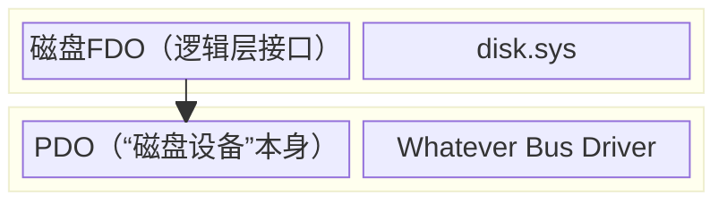
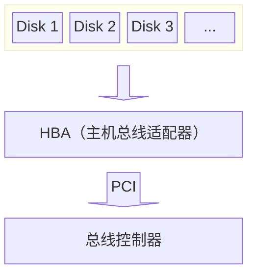
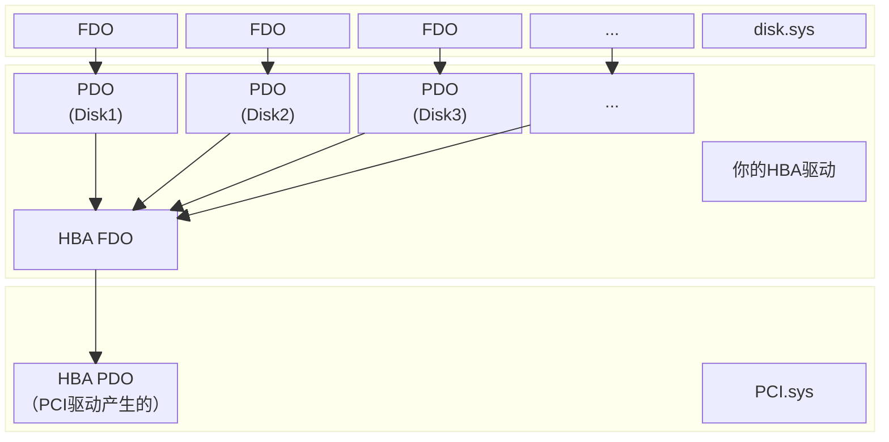

---
use-mermaid: 1
---

# 01 Storport 简述

## Storport负责什么？

Windows上，下层的驱动为磁盘产生一个PDO，然后disk.sys会产生磁盘FDO挂在上面。



<br>
在普通PC主板上，电路连接一般是这样的：



<br>
如果你愿意绕过微软的条条框框，可以做一个这样架构的驱动来提供磁盘PDO：


在这种模式下，参考开机时枚举设备的过程，HAL先从ACPI信息里找到PCI总线，然后为各种PCI设备产生它们的PDO；然后遍历树初始化PCI设备的时候，加载这个PCI设备的驱动。

于是PCI总线上的HBA就被加载了你编写的这个HBA驱动，它的`AddDevice`会创建这个HBA的FDO挂在PCI的PDO上面，这样HBA就初始化完成了。随后PnP管理器会重新枚举这个设备（看ReactOS源码可知，devnode指向的是PDO，而PnP管理器会沿着PDO找到*目前*的DO栈顶端也就是HBA FDO，然后向它发送`PNP/QUERY_DEVICE_RELATIONS`的IRP枚举它上面的设备），于是你的HBA驱动查了HBA寄存器，找到了所有的硬盘，为它们产生了PDO。

## 那么Storport是什么？

Storport是为了减少让HBA厂家自己写~~垃圾~~代码~~导致Windows不稳定~~而产生的中间件。Storport以一个类似于动态库的形式存在（但其实它是磁盘IO逻辑的中心），用户编写的Storport Miniport需要调用Storport的API、向Storport注册一些必须实现的（和可以不实现的）回调函数，结合起来组成面向硬件的磁盘IO。

## 用上Storport之后：

取代了上图中“HBA驱动”部分的，是你的Miniport驱动。所以，PnP对HBA的PDO加载驱动的时候，你的Miniport驱动的`DriverEntry`将被执行：
    
（KD调试内容来自安装在VMWare Workstation 17上的Win7 SP1 7601，使用模拟的LSI SAS HBA。后文所有基于Windows的调试均出自于此。）
    
```
kd> bp lsi_sas!DriverEntry
kd> bp storport!RaDriverAddDevice
kd> g
Breakpoint 3 hit
lsi_sas!DriverEntry:
fffff880`00fa3008 48895c2408      mov     qword ptr [rsp+8],rbx
kd> k
Child-SP          RetAddr           Call Site
fffff880`009b06d8 fffff800`045e3c78 lsi_sas!DriverEntry [e:\win7\drivers\oem\src\storage\lsi_sas\ca_init.c @ 103]
fffff880`009b06e0 fffff800`045e3dce nt!IopInitializeBuiltinDriver+0x368
fffff880`009b07b0 fffff800`045e476a nt!PnpInitializeBootStartDriver+0xbe
fffff880`009b0830 fffff800`045e523f nt!IopInitializeBootDrivers+0x44a
fffff880`009b0900 fffff800`045e8443 nt!IoInitSystem+0x80f
fffff880`009b0a00 fffff800`0454be89 nt!Phase1InitializationDiscard+0x1293
fffff880`009b0bd0 fffff800`0439e1a0 nt!Phase1Initialization+0x9
fffff880`009b0c00 fffff800`040f6ba6 nt!PspSystemThreadStartup+0x194
fffff880`009b0c40 00000000`00000000 nt!KxStartSystemThread+0x16
```
    
但是，Storport miniport会调用`storport!StorPortInitialize`初始化Miniport驱动对象。DriverObject将被作为参数传入（一同还有`HW_INITIALIZATION_INFO`结构体里的回调、配置参数等）；**此函数会将`DRIVER_OBJECT::MajorFunction`的若干函数填写为Storport自己的实现。**

所以，后面PnP管理器为这个还没有驱动认领的HBA PDO调用驱动`AddDevice`时，接手的其实是Storport的函数：

```
kd> g
Breakpoint 4 hit
storport!RaDriverAddDevice:
fffff880`01059dc0 48895c2408      mov     qword ptr [rsp+8],rbx
kd> k
Child-SP          RetAddr           Call Site
fffff880`009b0488 fffff800`041c3176 storport!RaDriverAddDevice
fffff880`009b0490 fffff800`0447a375 nt!PpvUtilCallAddDevice+0x36
fffff880`009b04d0 fffff800`0447dfa1 nt!PnpCallAddDevice+0xd5
fffff880`009b0550 fffff800`0447e1ef nt!PipCallDriverAddDevice+0x661
fffff880`009b0700 fffff800`045e298e nt!PiProcessAddBootDevices+0x4f
fffff880`009b0730 fffff800`044c07a1 nt!PipAddDevicesToBootDriverWorker+0x1e
fffff880`009b0760 fffff800`045d50f3 nt!PipApplyFunctionToServiceInstances+0x1e1
fffff880`009b07e0 fffff800`045e47ec nt!PipAddDevicesToBootDriver+0x33
fffff880`009b0830 fffff800`045e523f nt!IopInitializeBootDrivers+0x4cc
fffff880`009b0900 fffff800`045e8443 nt!IoInitSystem+0x80f
fffff880`009b0a00 fffff800`0454be89 nt!Phase1InitializationDiscard+0x1293
fffff880`009b0bd0 fffff800`0439e1a0 nt!Phase1Initialization+0x9
fffff880`009b0c00 fffff800`040f6ba6 nt!PspSystemThreadStartup+0x194
fffff880`009b0c40 00000000`00000000 nt!KxStartSystemThread+0x16
kd> !drvobj rcx
Driver object (fffffa8031ec87c0) is for:
\Driver\LSI_SAS
Driver Extension List: (id , addr)
(fffff8800104b090 fffffa8031001630)  
Device Object list:

kd> !devobj rdx
Device object (fffffa8031eb7060) is for:
NTPNP_PCI0045 \Driver\pci DriverObject fffffa8032638da0
Current Irp 00000000 RefCount 0 Type 00000022 Flags 00001040
Dacl fffff9a10008b861 DevExt fffffa8031eb71b0 DevObjExt fffffa8031eb75d8 DevNode fffffa80323be6e0 
ExtensionFlags (0x00000810)  DOE_START_PENDING
                            Unknown flags 0x00000800
AttachedDevice (Upper) fffffa8030e90190 \Driver\ACPI
Device queue is not busy.
```

可以看到对PCI驱动产生的PDO（RDX的Device Object，第二参数。此处调用约定为Fastcall）调用`AddDevice`，却调到了Storport的地盘上。Storport拿到的Driver Object（在RCX中，第一参数）其实是Miniport的，这也是Storport其实是一个函数库的侧面印证（但不妨碍是它处理了大部分的逻辑的事实）。

于是Storport“替”你创建了HBA的FDO，`IoCreateDevice`里填写的也还是Miniport的Driver Object，但是因为Major Function回调全都写成了Storport的，所以后续所有对FDO的IRP还是会先抵达Storport自己的IRP处理函数。

```
kd> x storport!RaDriver*
fffff880`0105d9d0 storport!RaDriverPowerIrp = <no type information>
fffff880`010446c0 storport!RaDriverScsiIrp = <no type information>
fffff880`01096010 storport!RaDriverDeviceControlIrp = <no type information>
fffff880`0104fdc0 storport!RaDriverDeleteDevice = <no type information>
fffff880`0109b1c0 storport!RaDriverCloseIrp = <no type information>
fffff880`0109b2a0 storport!RaDriverCreateIrp = <no type information>
fffff880`01059dc0 storport!RaDriverAddDevice = <no type information>
fffff880`0109bf40 storport!RaDriverSystemControlIrp = <no type information>
fffff880`0109cb00 storport!RaDriverPnpIrp = <no type information>
fffff880`01058020 storport!RaDriverUnload = <no type information>
```

眼熟不？这些就是Storport的Major Function。所以后续`IRP_MJ_PNP`抵达HBA FDO的时候，Storport会接住这个IRP（在`storport!RaDriverPnpIrp`），判断一下发现这个是HBA FDO（在Device Extension的第一个DWORD中有记录，因为Storport也处理逻辑磁盘PDO的IRP（以后会写）；第一个DWORD是0就是HBA FDO，是1就是逻辑磁盘PDO），于是开始想办法找HBA Miniport查询HBA上接的所有硬盘。

`PNP/START_DEVICE`的处理：

- Extension的Dump：
    ```
    kd> g
    Breakpoint 6 hit
    storport!RaDriverPnpIrp:
    fffff880`01084b00 4c8bdc          mov     r11,rsp
    kd> !devobj rcx
    Device object (fffffa8031f32060) is for:
    RaidPort0 \Driver\LSI_SAS DriverObject fffffa8031eca7c0
    Current Irp 00000000 RefCount 0 Type 00000004 Flags 00000050
    Dacl fffff9a1002c07d1 DevExt fffffa8031f321b0 DevObjExt fffffa8031f32b40 
    ExtensionFlags (0000000000)  
    AttachedTo (Lower) fffffa8030e73340 \Driver\ACPI
    Device queue is not busy.
    kd> dd fffffa8031f321b0
    fffffa80`31f321b0  00000000 00000000 31f32060 fffffa80
    fffffa80`31f321c0  319c5980 fffffa80 30e73340 fffffa80
    fffffa80`31f321d0  31eb7060 fffffa80 00240022 00000000
    fffffa80`31f321e0  001d4630 fffff8a0 00000002 00000000
    fffffa80`31f321f0  319c59b8 fffffa80 319c59b8 fffffa80
    fffffa80`31f32200  00000000 00000000 00000001 00000000
    fffffa80`31f32210  00000000 00000000 01010007 00000000
    fffffa80`31f32220  00000000 00000000 31f32228 fffffa80
    ```

- 查找适配器（HBA）的stack trace。StorAHCI在此处（`storahci!AhciHwFindAdapter`）已经开始根据PI（Ports Implemented，其实就是哪些口已经连接了硬盘）开始为每个端口分配必要的定时器、Command Table等资源了：

    （由于AHCI是开放的HBA标准且StorAHCI的源码已经公开，使用StorAHCI会比较容易讲解Storport与Miniport驱动之间的联动逻辑。后面会有更多关于StorAHCI的解读）

    ```
    storport!RaDriverPnpIrp:
    fffff880`01084b00 4c8bdc          mov     r11,rsp
    kd> k
    Child-SP          RetAddr           Call Site
    fffff880`009aff18 fffff800`04513c0c storport!RaDriverPnpIrp
    fffff880`009aff20 fffff880`01080723 nt!IoGetDmaAdapter+0x15c
    fffff880`009b0010 fffff880`0103fcf1 storport!RaidInitializeDma+0xc3
    fffff880`009b0070 fffff880`00e02524 storport!StorPortGetUncachedExtension+0x61
    fffff880`009b00b0 fffff880`0103787d lsi_sas!LSImpiFindAdapter+0x1428 [e:\win7\drivers\oem\src\storage\lsi_sas\ca_init.c @ 1300]
    fffff880`009b0150 fffff880`01040d68 storport!RaCallMiniportFindAdapter+0x6d
    fffff880`009b01a0 fffff880`010846a8 storport!RaidAdapterStartMiniport+0x68
    fffff880`009b0200 fffff880`010849f0 storport!RaidAdapterStartDeviceIrp+0xe8
    fffff880`009b0250 fffff880`01084b94 storport!RaidAdapterPnpIrp+0x140
    fffff880`009b02b0 fffff800`04442a2e storport!RaDriverPnpIrp+0x94
    fffff880`009b02f0 fffff800`041a765d nt!PnpAsynchronousCall+0xce
    fffff880`009b0330 fffff800`04452246 nt!PnpStartDevice+0x11d
    fffff880`009b03f0 fffff800`044524e4 nt!PnpStartDeviceNode+0x156
    fffff880`009b0480 fffff800`04471516 nt!PipProcessStartPhase1+0x74
    fffff880`009b04b0 fffff800`041b5b2e nt!PipProcessDevNodeTree+0x296
    fffff880`009b0720 fffff800`041b604e nt!PnpDeviceActionWorker+0x1ee
    fffff880`009b07c0 fffff800`045d6811 nt!PnpRequestDeviceAction+0x2be
    fffff880`009b0830 fffff800`045d723f nt!IopInitializeBootDrivers+0x4f1
    fffff880`009b0900 fffff800`045da443 nt!IoInitSystem+0x80f
    fffff880`009b0a00 fffff800`0453de89 nt!Phase1InitializationDiscard+0x1293
    fffff880`009b0bd0 fffff800`043901a0 nt!Phase1Initialization+0x9
    fffff880`009b0c00 fffff800`040e8ba6 nt!PspSystemThreadStartup+0x194
    fffff880`009b0c40 00000000`00000000 nt!KxStartSystemThread+0x16
    ```

- 调用Miniport的HwInitialize函数的调用栈；此函数在`DISPATCH_LEVEL`被调用；在此处，StorAHCI会检测AHCI使用的中断模式（并保存备用）、启用DPC重定向（到其他处理器；这个好像只有服务器SKU才允许使用）、启用所有Channel，还会设定`PassiveInitialization`函数（`AhciHwPassiveInitialize`；此初始化函数微软说用来初始化DPC，在`PASSIVE_LEVEL`被调用；实际Storport还在里面初始化了PoFx也就是电源管理的一些逻辑）：

    ```
    Breakpoint 5 hit
    lsi_sas!LSImpiHWInitialize:
    fffff880`00e02b34 488bc4          mov     rax,rsp
    kd> k
    Child-SP          RetAddr           Call Site
    fffff880`009b0168 fffff880`01034bcc lsi_sas!LSImpiHWInitialize [e:\win7\drivers\oem\src\storage\lsi_sas\ca_init.c @ 1495]
    fffff880`009b0170 fffff880`01040e0d storport!RaCallMiniportHwInitialize+0x1c
    fffff880`009b01a0 fffff880`010846a8 storport!RaidAdapterStartMiniport+0x10d
    fffff880`009b0200 fffff880`010849f0 storport!RaidAdapterStartDeviceIrp+0xe8
    fffff880`009b0250 fffff880`01084b94 storport!RaidAdapterPnpIrp+0x140
    fffff880`009b02b0 fffff800`04442a2e storport!RaDriverPnpIrp+0x94
    fffff880`009b02f0 fffff800`041a765d nt!PnpAsynchronousCall+0xce
    fffff880`009b0330 fffff800`04452246 nt!PnpStartDevice+0x11d
    fffff880`009b03f0 fffff800`044524e4 nt!PnpStartDeviceNode+0x156
    fffff880`009b0480 fffff800`04471516 nt!PipProcessStartPhase1+0x74
    fffff880`009b04b0 fffff800`041b5b2e nt!PipProcessDevNodeTree+0x296
    fffff880`009b0720 fffff800`041b604e nt!PnpDeviceActionWorker+0x1ee
    fffff880`009b07c0 fffff800`045d6811 nt!PnpRequestDeviceAction+0x2be
    fffff880`009b0830 fffff800`045d723f nt!IopInitializeBootDrivers+0x4f1
    fffff880`009b0900 fffff800`045da443 nt!IoInitSystem+0x80f
    fffff880`009b0a00 fffff800`0453de89 nt!Phase1InitializationDiscard+0x1293
    fffff880`009b0bd0 fffff800`043901a0 nt!Phase1Initialization+0x9
    fffff880`009b0c00 fffff800`040e8ba6 nt!PspSystemThreadStartup+0x194
    fffff880`009b0c40 00000000`00000000 nt!KxStartSystemThread+0x16
    ```

`PNP/QUERY_DEVICE_RELATIONS`的处理：

- 查找磁盘（CDB Command = 0xA0, Report LUNs）

    调试方法：

    先试图拦截对应的函数。拦截HBA FDO上QueryDeviceRelations的处理函数；同时因为向HBA请求LUN号会发送SCSI包，所以也拦截一下驱动总体的SCSI IRP处理函数：
    ```
    kd> bp storport!RaidAdapterQueryDeviceRelationsIrp
    kd> bp storport!RaDriverScsiIrp
    ```

    g几次直到在SCSI IRP函数停下。前面应该还触发了一次Query Device Relations断点。
    ```
    Breakpoint 8 hit
    storport!RaDriverScsiIrp:
    fffff880`0102c6c0 4889742418      mov     qword ptr [rsp+18h],rsi
    kd> k
    Child-SP          RetAddr           Call Site
    fffff880`009afd18 fffff880`0103adae storport!RaDriverScsiIrp
    fffff880`009afd20 fffff880`0103c961 storport!RaSendIrpSynchronous+0x4e
    fffff880`009afd80 fffff880`01040191 storport!RaidBusEnumeratorIssueSynchronousRequest+0x91
    fffff880`009afe90 fffff880`010402be storport!RaidBusEnumeratorIssueReportLuns+0x71
    fffff880`009afee0 fffff880`0104661b storport!RaidBusEnumeratorGetLunListFromTarget+0xae
    fffff880`009aff60 fffff880`01046764 storport!RaidBusEnumeratorGetLunList+0x5b
    fffff880`009afff0 fffff880`01046856 storport!RaidAdapterEnumerateBus+0x94
    fffff880`009b0160 fffff880`010847f2 storport!RaidAdapterRescanBus+0x76
    fffff880`009b0270 fffff880`01084a00 storport!RaidAdapterQueryDeviceRelationsIrp+0xa2
    fffff880`009b02b0 fffff880`01084b94 storport!RaidAdapterPnpIrp+0x150
    fffff880`009b0310 fffff800`04442a2e storport!RaDriverPnpIrp+0x94
    fffff880`009b0350 fffff800`04442eea nt!PnpAsynchronousCall+0xce
    fffff880`009b0390 fffff800`04445237 nt!PnpQueryDeviceRelations+0xfa
    fffff880`009b0450 fffff800`0447149c nt!PipEnumerateDevice+0x117
    fffff880`009b04b0 fffff800`041b5b2e nt!PipProcessDevNodeTree+0x21c
    fffff880`009b0720 fffff800`041b604e nt!PnpDeviceActionWorker+0x1ee
    fffff880`009b07c0 fffff800`045d6811 nt!PnpRequestDeviceAction+0x2be
    fffff880`009b0830 fffff800`045d723f nt!IopInitializeBootDrivers+0x4f1
    fffff880`009b0900 fffff800`045da443 nt!IoInitSystem+0x80f
    fffff880`009b0a00 fffff800`0453de89 nt!Phase1InitializationDiscard+0x1293
    fffff880`009b0bd0 fffff800`043901a0 nt!Phase1Initialization+0x9
    fffff880`009b0c00 fffff800`040e8ba6 nt!PspSystemThreadStartup+0x194
    fffff880`009b0c40 00000000`00000000 nt!KxStartSystemThread+0x16
    ```

    IRP在RDX寄存器中。读取IRP结构体（无关部分省略）：
    ```
    kd> dt nt!_IRP fffffa8031e11d50 -b
       +0x000 Type             : 0n6
       +0x002 Size             : 0x118
    ......
       +0x070 UserBuffer       : (null) 
       +0x078 Tail             : <unnamed-tag>
          +0x000 Overlay          : <unnamed-tag>
             +0x000 DeviceQueueEntry : _KDEVICE_QUEUE_ENTRY
                [省略]
             +0x000 DriverContext    : 
              [省略]
             +0x020 Thread           : (null) 
             +0x028 AuxiliaryBuffer  : (null) 
             +0x030 ListEntry        : _LIST_ENTRY [ 0x00000000`00000000 - 0x0 ]
                +0x000 Flink            : (null) 
                +0x008 Blink            : (null) 
             +0x040 CurrentStackLocation : 0xfffffa80`31e11e20 
    ......
    ```

    我们想看SRB（SCSI Request Block。没错，Storport声称和RAID HBA等高性能设备通信，抛弃了SCSIport，但背地里Windows整个储存栈其实还是以SCSI请求包运作的。Win8以后有`STORAGE_REQUEST_BLOCK`，但本文不研究），SRB在当前IRP栈位（上文代码块的CurrentStackLocation指针，指向`IO_STACK_LOCATION`）的`Parameters`里面。dt命令不能自动展开，需要手动取一下：

    ```
    kd> dt -b nt!_IO_STACK_LOCATION 0xfffffa80`31e11e20 
       +0x000 MajorFunction    : 0xf ''
       +0x001 MinorFunction    : 0xf0 ''
       +0x002 Flags            : 0 ''
       +0x003 Control          : 0xe0 ''
       +0x008 Parameters       : <unnamed-tag>
          +0x000 Create           : <unnamed-tag>
          ......
          +0x000 Scsi             : <unnamed-tag>
             +0x000 Srb              : 0xfffffa80`30fface0 
          ......
    ```

    看到SRB了。再取一下：
    ```
    kd> dt -b _SCSI_REQUEST_BLOCK 0xfffffa80`30fface0 
    lsi_sas!_SCSI_REQUEST_BLOCK
       +0x000 Length           : 0x58
       +0x002 Function         : 0 ''
       +0x003 SrbStatus        : 0 ''
       +0x004 ScsiStatus       : 0 ''
       +0x005 PathId           : 0 ''
       +0x006 TargetId         : 0 ''
       +0x007 Lun              : 0 ''
       +0x008 QueueTag         : 0 ''
       +0x009 QueueAction      : 0 ''
       +0x00a CdbLength        : 0xc ''
       +0x00b SenseInfoBufferLength : 0x12 ''
       +0x00c SrbFlags         : 0x80158
       +0x010 DataTransferLength : 0x10
       +0x014 TimeOutValue     : 0xa
       +0x018 DataBuffer       : 0xfffffa80`30f627e0 
       +0x020 SenseInfoBuffer  : 0xfffffa80`322cda20 
       +0x028 NextSrb          : (null) 
       +0x030 OriginalRequest  : (null) 
       +0x038 SrbExtension     : (null) 
       +0x040 InternalStatus   : 0
       +0x040 QueueSortKey     : 0
       +0x040 LinkTimeoutValue : 0
       +0x044 Reserved         : 0
       +0x048 Cdb              :  "???"
        [00] 0xa0 ''
        [01] 0 ''
        [02] 0 ''
        [03] 0 ''
        [04] 0 ''
        [05] 0 ''
        [06] 0 ''
        [07] 0 ''
        [08] 0 ''
        [09] 0x10 ''
        [10] 0 ''
        [11] 0 ''
        [12] 0 ''
        [13] 0 ''
        [14] 0 ''
        [15] 0 ''
    ```

    CDB（SCSI的Command Descriptor Block）长度为12，第一个字节为0xA0，查询SCSI资料可知这是Report LUNs命令。在StorAHCI（源码可查，方便解读）中这会向ATA设备发送一个`IDENTIFY DEVICE`命令查询设备能力。

等等如此。可见Miniport通过把所有的Major Function设为Storport的实现，把对设备对象的实质控制权“拱手让给”了Storport，而自己只在Storport需要时被调用（虽然加载驱动的时候还是写的他的名字）。

\* **本节结束**
